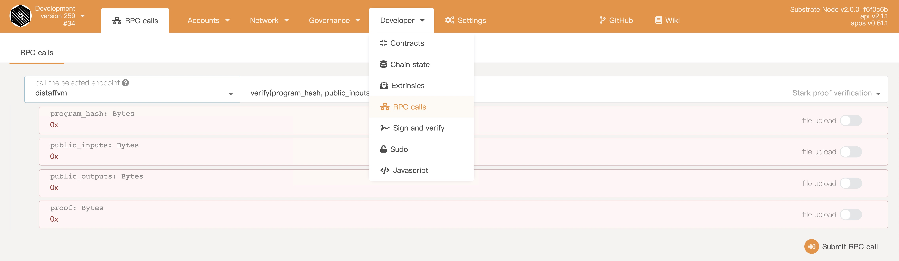
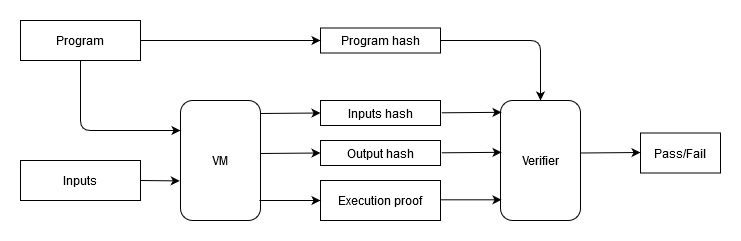
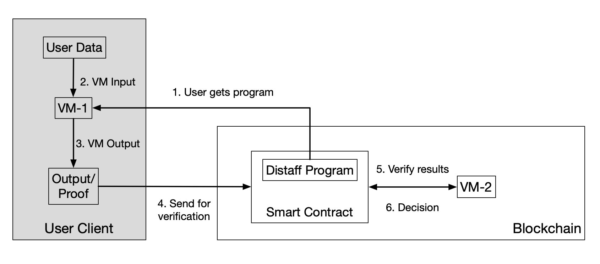

# Starks Network

## Introduction

The Starks Network aims to improve the privacy and scalability of public blockchains—such as Polkadot/Kusama. It provides zero-knowledge proof as a service to enable a wide range of applications from privacy-preserving credentials to novel DeFi infrastructures. 

The Starks Node is built upon the the [Substrate](https://github.com/paritytech/substrate) blockchain framework. At its core, it uses the [Distaff VM](https://github.com/GuildOfWeavers/distaff), a zk-STARK virtual machine, for STARK proof generation and verification. In the future, the Starks Network aims to become a parachain/parathread in Polkadot/Kusama and serve other chains in the network via cross-chain communications. 

## Quick Demo Walkthrough

Pull the Starks Node and UI docker images.

```
$ docker pull starksnetwork/starks-node:0.0.5
$ docker pull starksnetwork/starks-ui:ms-1
```

Start the node container to setup a local test network. Start the ui container to interact with the node. 

```
$ docker run -d --name starks-ui -p 3000:80 starksnetwork/starks-ui:ms-1
$ docker run --name starks-node -p 9944:9944 starksnetwork/starks-node:0.0.5 --dev --rpc-external --ws-external
```

Open browser, enter url: `127.0.0.1:3000` to access the web app. On the top-left corner, switch to DEVELOPMENT -> Local Node (127.0.0.1:9944) in order to connect to the test network. 

Navigate in the menu: Developer -> RPC calls, call the selected endpoint `distaffvm` and use the `verify` function as shown below. 



There are two ways to get example proof data for verification purpose. One is to download some pre-generated [proof data](https://github.com/gbctech/starks-node/raw/master/docs/proof_example/distaff_proof_example.zip), unzip and upload the files as specified in each of the four RPC fields. Then click **Submit RPC call**. You should observe "verification passed" as the output. This means the proof data, along with other data, have been sent to the Distaff VM in the substrate chain and a verification operation has been successfully performed. 

If you want to generate STARK proof data by yourself, you can clone the [Distaff VM repo](https://github.com/gbctech/distaff), compile it and run some example cases to get the proof data, like so:

```
$ git clone https://github.com/gbctech/distaff
$ cd distaff
$ cargo build --release
$ target/release/distaff
```

You should be able to find four text files (begin with s_) in the distaff project directory and use them as input for the RPC calls fields above. 

## Build and Run the Local Docker Image 

```
$ git clone https://github.com/gbctech/starks-node.git
$ cd starks-node
$ docker build -t local/starks-node .
// load the node docker container
$ docker run --name starks-node -p 9944:9944 local/starks-node --dev --rpc-external --ws-external
```

## Build Starks Node Binary

Build the Starks Node locally. 

```
// in project directory
$ cargo build --release
// run the Starks Node binary in dev mode
$ target/release/starks-node --dev
```

## Tests

Test of the Distaff VM as a Substrate primitive package can be carried out like so:

```
// in project directory
$ cargo test -p primitives-stark
```

Test of the Distaff VM frame can be carried out like so:

```
// in project directory
$ cargo test -p frame-distaff-vm
```

## Brief Introduction to the Distaff VM

A high level [architecture of the Distaff VM](https://ethresear.ch/t/a-sketch-for-a-stark-based-vm/7048) is shown as the following.



The Distaff VM provides a set of assembly language which can be used to construct a general purpose computation into a *program* which can be interpreted by the virtual machine. The basic work flow of the VM is:

a. Takes 2 inputs: a program and a set of inputs for the program;

b. Executes the program with the given set of inputs;

c. Outputs hash of the inputs, hash of the outputs generated by the program, and a STARK proof attesting to the correct execution of the program.

Then the verifier can take the hash of the program, hash of the inputs, and hash of the outputs, and uses them to verify the STARK proof. As such, the user can prove to the verifier that she owns some secret data which, when used as the input of a program, can yield certain output. She never has to reveal the input data to the verifier; thus her privacy is protected.  

One way to automate this process is to set up a smart contract on the blockchain which can perform the proof verification. As such, a lot of real-world verification work can be moved on-chain and the users never have to give away their secrets for e.g. credential verification. 

## Architecture of the Starks Network 

The overall system architecture and the basic work flow of STARK proof generation and verification on the Starks Network is shown as following.



a. A verifier will set up an on-chain smart contract with a target Distaff VM program embedded.

b. A user will interact with the smart contact, get the program and generate a proof with their secret inputs using the Distaff VM embedded in the user client application (Step 1, 2 and 3). 

c. The user sends the hashes and proof data (results) back to the smart contract via a transaction (Step 4).

d. The smart contract will verify the results using the Distaff VM built in the blockchain node binary, make a decision and update its state (Step 5 and 6).

As such, the user has interacted with an on-chain smart contract without revealing their secret data. It should be noted that the Distaff VM will be made as part of the user client application for proof generation. It will also be made as part of the blockchain node binary and accessible to the on-chain smart contracts. 


